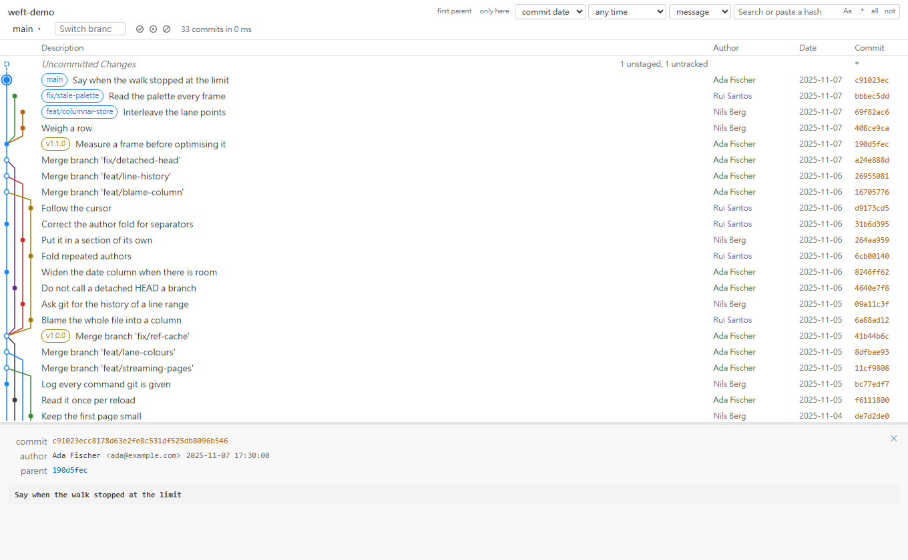

# Git Weft

A Git commit graph for VS Code, fast on large repositories.

<picture>
  <source media="(prefers-color-scheme: dark)" srcset="docs/images/graph-dark.png">
  
</picture>

Weft is an independent extension, written from scratch. It is not a fork of, and shares no code
with, any other graph extension.

**Early, but in daily use.** Reading is complete; writing is arriving one tier at a time.

## What it does

- **A graph that stays fast on a big repository.** A 100,000-commit history is walked and laid out
  in about a second, the first rows paint while git is still walking, and a frame takes under a
  millisecond to draw. Numbers, and how they were taken, in [the design notes](https://github.com/HouseAlwaysWin/Git-Weft/blob/main/docs/design.md).
- **Opens on the branch you are on.** A clone with fourteen hundred refs would otherwise spend
  seconds drawing a graph so wide that the branch you came to look at is one lane among hundreds.
  Tick more in **Branches & Tags**, or from the graph's own header.
- **Search pushed down into `git log`** - by message, author, committer, diff content or path -
  so a query on a large history costs a walk rather than a walk plus a filter. Paste a hash and it
  goes there instead.
- **Blame where you are reading.** Who last changed the line the cursor is on, at the end of that
  line; the whole file's authors in a column when you ask; and **Show Line History** for the commits
  that touched the lines you have selected.
- **Write actions from the graph** - checkout, branch, merge, rebase, cherry-pick, revert, reset,
  stash, tags, remotes, fetch, pull, push. Anything that could destroy uncommitted work names the
  files it would destroy before asking, and nothing passes `--force` by default.
- **Authors folded into people.** `Sean Lin`, `sean_lin` and `SEAN_LIN` are one row and one count,
  with the spellings inside it. Where the rule cannot tell, group them by hand - or ungroup two it
  folded that turn out to be two people.
- **Ordinary clones, bare repositories, linked worktrees, submodules**, and more than one repository
  in a workspace - one graph per repository, each its own tab.

Everything else it does is [in the full list](https://github.com/HouseAlwaysWin/Git-Weft/blob/main/docs/features.md).

## Where to find it

The graph opens as an editor tab. Three ways in:

- The **Weft** button in the status bar (hidden when the workspace has no repository)
- The branch icon in the **Source Control** title bar
- **Weft: Open Git Graph** in the command palette

Weft has no Activity Bar icon of its own. Its sections - **Commit Files**, **Branches & Tags**,
**Authors**, and **Line History** once you have asked for one - live in **Source Control**, under
the changes list: collapsed until you want them, and absent altogether in a workspace with no
repository. Unticking a ref there narrows
what `git log` walks, so a repository carrying two hundred `origin/dependabot/*` branches stops
paying for them.

## Install

Download the `.vsix` from [Releases](https://github.com/HouseAlwaysWin/Git-Weft/releases), then in
VS Code: **Extensions** → **…** → **Install from VSIX…**. Or from a terminal:

```
code --install-extension git-weft-<version>.vsix
```

Requires VS Code 1.100 or later, and git on your `PATH`.

## Development

Building, testing and the preview harness are in [CONTRIBUTING.md](https://github.com/HouseAlwaysWin/Git-Weft/blob/main/CONTRIBUTING.md).

## Licence

MIT. See [LICENSE](https://github.com/HouseAlwaysWin/Git-Weft/blob/main/LICENSE), and [THIRD-PARTY-NOTICES.md](https://github.com/HouseAlwaysWin/Git-Weft/blob/main/THIRD-PARTY-NOTICES.md) for the lane
layout algorithm's attribution.
